<div align="center">

# raft-consensus

**A complete Raft distributed consensus implementation in Go - built from scratch.**

Leader election · Log replication · Log compaction · Linearizable KV store

[](https://go.dev)
[](#test-coverage)
[](LICENSE)

</div>

---

## Table of Contents

- [What is Raft?](#what-is-raft)
- [Architecture](#architecture)
- [How It Works](#how-it-works)
  - [Leader Election](#1-leader-election)
  - [Log Replication](#2-log-replication)
  - [Snapshotting & Log Compaction](#3-snapshotting--log-compaction)
  - [KV Store Layer](#4-kv-store-layer)
- [Project Structure](#project-structure)
- [Quick Start](#quick-start)
- [Configuration](#configuration)
- [API Usage](#api-usage)
- [Test Coverage](#test-coverage)
- [Safety Properties](#safety-properties)
- [References](#references)

---

## What is Raft?

Raft is a distributed consensus algorithm designed to be **understandable**. It solves the fundamental problem of making a cluster of machines agree on a shared, ordered log of commands - even when some machines crash or become unreachable.

Every server that applies the same log in the same order reaches the same state, making the cluster behave like a single reliable machine despite individual failures.

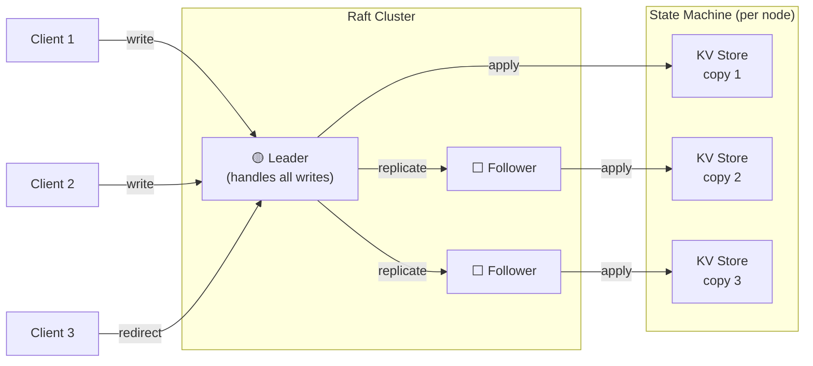

**Three core guarantees:**

| Guarantee | Meaning |
|---|---|
| **Election Safety** | At most one leader per term |
| **Log Matching** | If two logs have an entry at the same index with the same term, they are identical up to that point |
| **Leader Completeness** | A committed entry will always be present in all future leaders' logs |

---

## Architecture

The implementation is structured in three clean layers, each with a well-defined interface boundary.

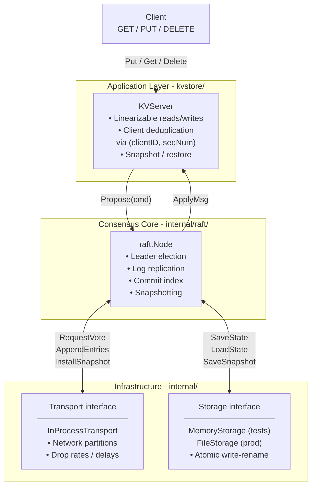

---

## How It Works

### 1. Leader Election

Every node starts as a **Follower**. If a follower doesn't hear from a leader within its randomised election timeout (150–300 ms), it becomes a **Candidate** and requests votes. A candidate that receives votes from a majority becomes **Leader**.

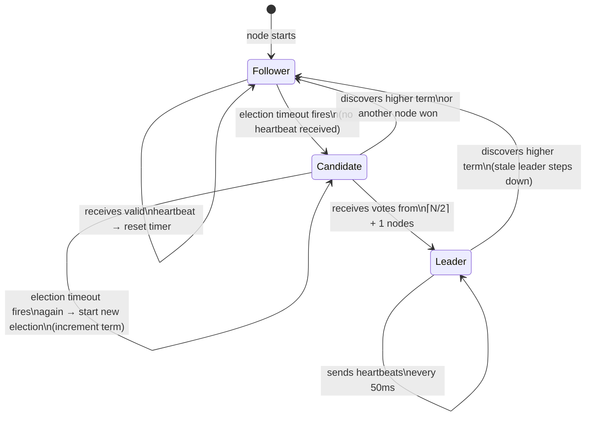

**Election timeline for a 3-node cluster:**

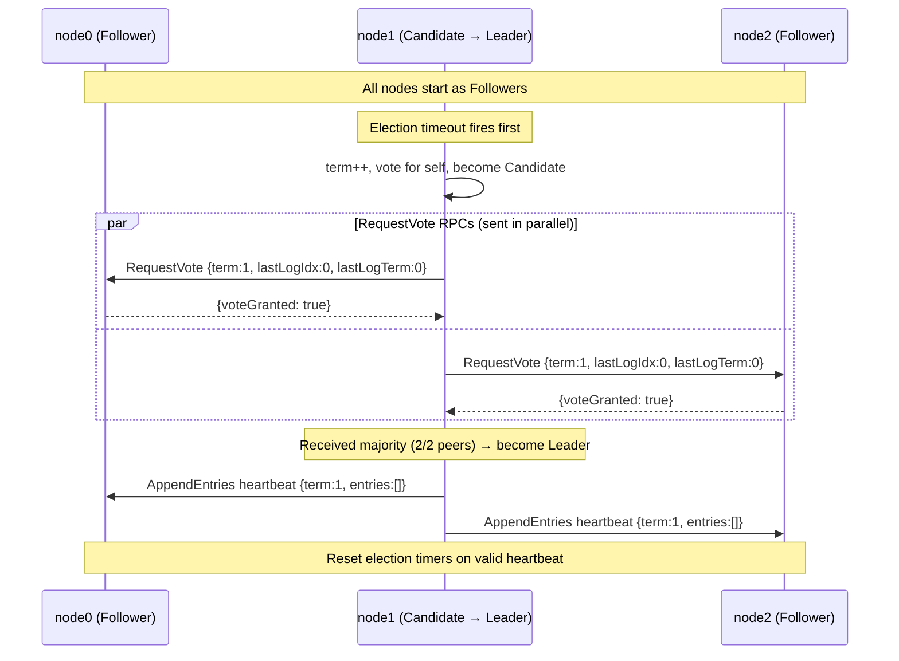

**Split-vote prevention:** Each node picks a random timeout in `[ElectionTimeoutMin, ElectionTimeoutMax]`. This ensures that in most elections, only one node times out first, avoiding ties. If a tie occurs, nodes increment their term and try again - the randomness ensures convergence.

---

### 2. Log Replication

All client writes go through the leader. The leader appends the command to its log, then replicates it to followers via `AppendEntries`. Once a majority has persisted the entry, it is **committed** and safe to apply to the state machine.

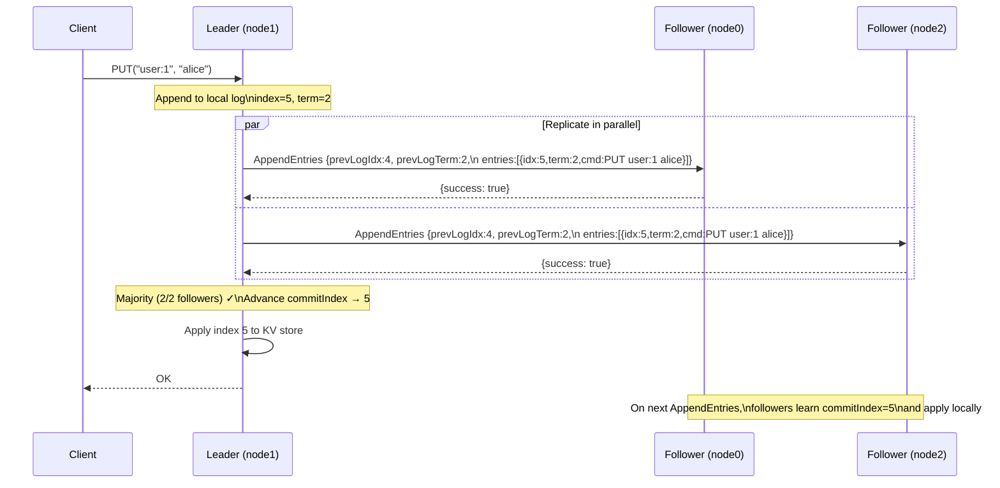

**The Raft log** maintains a strict ordering guarantee:

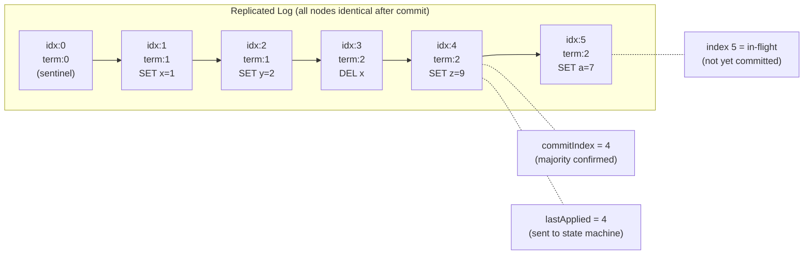

**Fast log rollback:** When a follower rejects `AppendEntries` due to a log mismatch, it returns `ConflictTerm` and `ConflictIndex` so the leader can jump back multiple entries in a single round-trip instead of decrementing `nextIndex` one-by-one.

---

### 3. Snapshotting & Log Compaction

Logs grow unboundedly. When the log exceeds `SnapshotThreshold` entries, the application takes a snapshot of its state machine. Raft compacts all entries up to `lastIncludedIndex` into the snapshot, freeing memory and disk space.

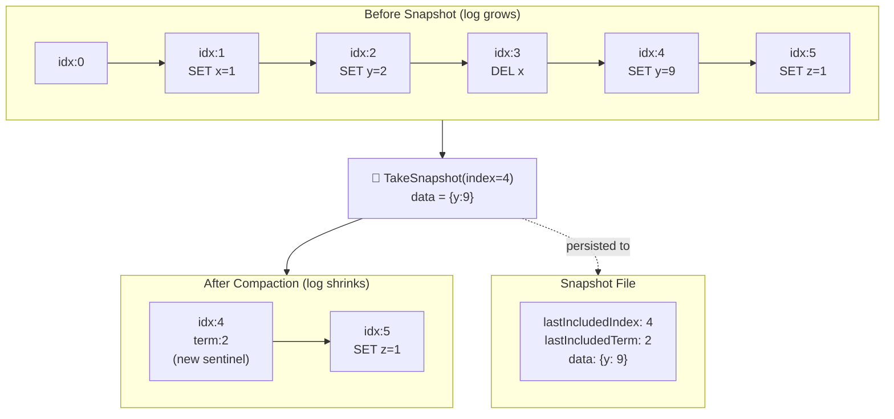

**Catching up a lagging follower via `InstallSnapshot`:**

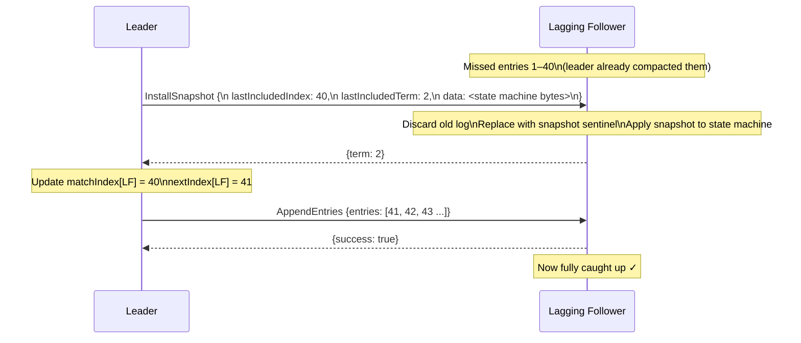

---

### 4. KV Store Layer

The KV store sits on top of Raft, turning the raw log replication into a **linearizable** key-value store. Every operation is serialised through the Raft log, ensuring all replicas apply commands in the same order.

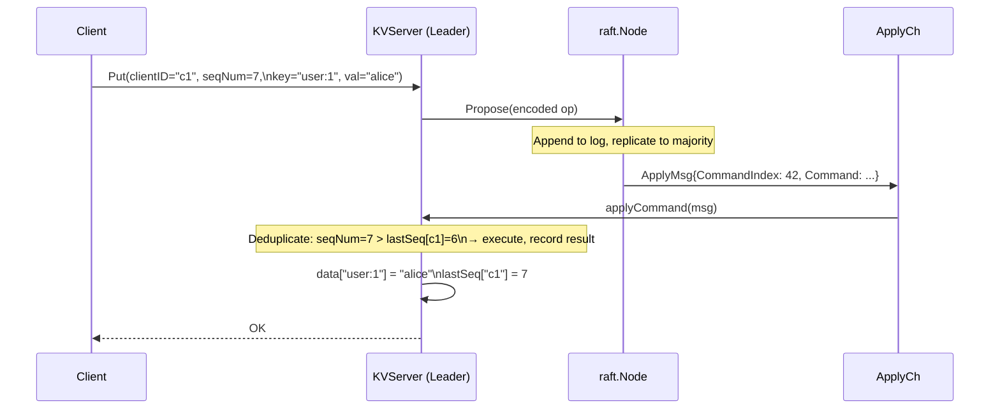

**Client deduplication** prevents double-writes when a client retries after a timeout:

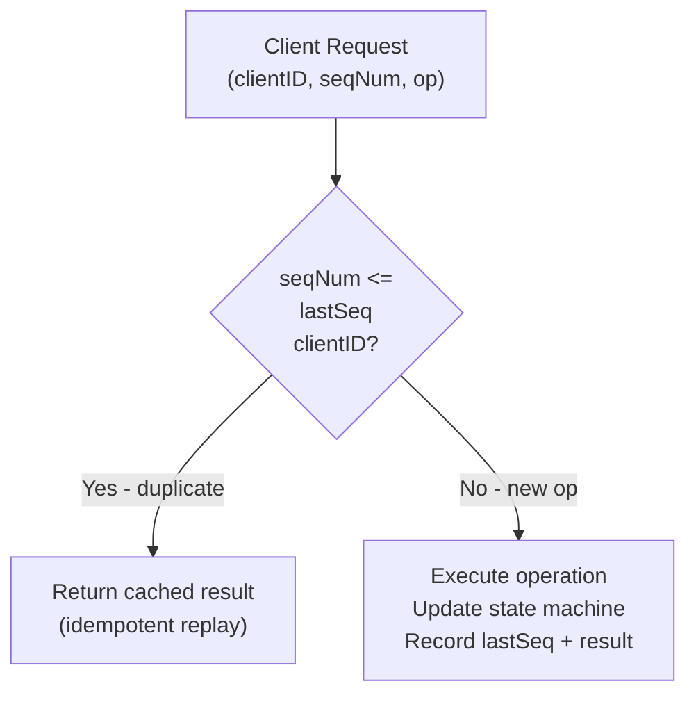

---

## Project Structure

```
raft-consensus/
│
├── internal/
│   ├── raft/
│   │   ├── types.go          # LogEntry, RPC structs, Config, ApplyMsg
│   │   ├── node.go           # Core Raft node - election, replication, snapshots
│   │   ├── cluster_test.go   # Reusable test cluster harness
│   │   └── raft_test.go      # 13 integration tests
│   │
│   ├── transport/
│   │   └── inprocess.go      # In-process transport with partition simulation
│   │
│   └── storage/
│       └── storage.go        # MemoryStorage + FileStorage (atomic write-rename)
│
├── kvstore/
│   ├── kvserver.go           # Linearizable KV store on top of Raft
│   └── kvstore_test.go       # 8 KV integration tests
│
├── cmd/
│   └── kvserver/
│       └── main.go           # Runnable demo: 3-node cluster
│
├── go.mod
└── README.md
```

---

## Quick Start

### Prerequisites

```bash
go version  # requires Go 1.21+
```

### Run the interactive demo

```bash
git clone https://github.com/sandeepkv93/raft-consensus.git
cd raft-consensus
go run ./cmd/kvserver
```

**Example output:**

```
╔══════════════════════════════════════════════╗
║   Raft Consensus - Live Demo (3-node KV)     ║
╚══════════════════════════════════════════════╝

⏳ Waiting for leader election...
✅ Leader elected: beta (term 1)

━━━━━━━━━━━━━━━━━━━━━━━━━━━━━━━━━━━━━━━━━━━━━━
  Demo 1: Basic KV Operations
━━━━━━━━━━━━━━━━━━━━━━━━━━━━━━━━━━━━━━━━━━━━━━
   client-1     PUT  user:1     = alice        err=<nil>
   client-1     PUT  user:2     = bob          err=<nil>
   client-1     PUT  user:3     = charlie      err=<nil>
   client-1     GET  user:1     → "alice"
   client-1     GET  user:2     → "bob"
   client-1     DEL  user:3     → err=<nil>
   client-1     GET  user:3     → (not found)

━━━━━━━━━━━━━━━━━━━━━━━━━━━━━━━━━━━━━━━━━━━━━━
  Demo 2: Leader Failure & Re-Election
━━━━━━━━━━━━━━━━━━━━━━━━━━━━━━━━━━━━━━━━━━━━━━
  Current leader: beta
  ❌ Disconnecting leader from cluster...
  ✅ New leader elected: gamma (term 3)
  📖 recovery-key = "cluster-recovered"
  ♻️  Reconnected beta - now rejoins as follower (term 3)

━━━━━━━━━━━━━━━━━━━━━━━━━━━━━━━━━━━━━━━━━━━━━━
  Demo 3: Node Status
━━━━━━━━━━━━━━━━━━━━━━━━━━━━━━━━━━━━━━━━━━━━━━
  alpha  state=Follower   term=3    leader=gamma
  beta   state=Follower   term=3    leader=gamma
  gamma  state=Leader     term=3    leader=gamma

✅ Demo complete.
```

### Run all tests

```bash
go test ./... -v -timeout 120s
```

### Run the stress test

```bash
go test ./internal/raft/... -run TestStress -v -timeout 120s
```

---

## Configuration

```go
cfg := raft.Config{
    // How often the leader broadcasts heartbeats.
    // Must be << ElectionTimeoutMin (broadcast time << election timeout).
    HeartbeatInterval: 50, // ms

    // Randomised election timeout range.
    // Randomisation prevents split votes.
    ElectionTimeoutMin: 150, // ms
    ElectionTimeoutMax: 300, // ms

    // Max log entries per AppendEntries RPC.
    // Prevents single RPCs from becoming too large.
    MaxLogEntriesPerRPC: 100,

    // Compact the log after this many entries.
    SnapshotThreshold: 1000,
}
```

**Timing relationships (Raft paper §5.6):**

```
broadcastTime  <<  electionTimeout  <<  MTBF
    ~1ms               150–300ms       hours/days
```

| Parameter | Development | Production |
|---|---|---|
| `HeartbeatInterval` | 15 ms | 50–150 ms |
| `ElectionTimeoutMin` | 50 ms | 150–500 ms |
| `ElectionTimeoutMax` | 100 ms | 300–1000 ms |

---

## API Usage

### Creating a Raft node

```go
import (
    "github.com/sandeepkv93/raft-consensus/internal/raft"
    "github.com/sandeepkv93/raft-consensus/internal/storage"
    "github.com/sandeepkv93/raft-consensus/internal/transport"
)

// 1. Create durable storage (survives restarts).
store, _ := storage.NewFileStorage("/data/node1")

// 2. Create the RPC transport.
tr := transport.NewInProcessTransport("node1")

// 3. Create the node.
applyCh := make(chan raft.ApplyMsg, 128)
node := raft.NewNode(
    "node1",
    []string{"node2", "node3"}, // peer IDs
    tr,
    store,
    applyCh,
    raft.DefaultConfig(),
)

// 4. Register peer nodes with the transport layer.
tr.Register("node2", node2)
tr.Register("node3", node3)

// 5. Start.
node.Start()
defer node.Stop()
```

### Proposing commands

```go
// Propose only succeeds on the leader.
idx, term, isLeader := node.Propose([]byte(`{"op":"set","key":"x","val":"1"}`))
if !isLeader {
    // Redirect client to node.LeaderID()
    return
}
// idx is the expected log index. Wait for ApplyMsg.CommandIndex == idx on applyCh.
```

### Consuming applied commands

```go
for msg := range applyCh {
    switch {
    case msg.CommandValid:
        // Safe to apply to your state machine.
        // msg.CommandIndex is monotonically increasing.
        applyToStateMachine(msg.Command)

        // Optionally trigger a snapshot.
        if msg.CommandIndex % snapshotInterval == 0 {
            snapData := stateMachine.Serialize()
            node.TakeSnapshot(msg.CommandIndex, snapData)
        }

    case msg.SnapshotValid:
        // Leader installed a snapshot (you were lagging).
        // Reset your state machine to the snapshot state.
        stateMachine.Restore(msg.Snapshot)
    }
}
```

### Using the KV store

```go
import "github.com/sandeepkv93/raft-consensus/kvstore"

// Create and start the KV server.
kv := kvstore.NewKVServer(node, applyCh)
kv.Start()
defer kv.Stop()

// Operations (only succeed on leader).
kv.Put("client-1", seqNum, "user:1", "alice")
val, err := kv.Get("client-1", seqNum, "user:1") // → "alice"
kv.Delete("client-1", seqNum, "user:1")
```

---

## Test Coverage

**21 tests · 0 failures** across Raft core and KV store.

### Raft Core (`internal/raft/`)

| Test | Scenario | Verifies |
|------|----------|----------|
| `TestElection_SingleLeader` | 3-node startup | Exactly one leader elected |
| `TestElection_FiveNode` | 5-node startup | Election scales correctly |
| `TestElection_TermMonotonicity` | Leader disconnected | New election uses higher term |
| `TestReplication_Basic` | Single command | Applied on all 3 nodes |
| `TestReplication_Sequential` | 20 commands | Applied in order on all nodes |
| `TestReplication_ConcurrentProposals` | 10 parallel proposals | All committed and applied |
| `TestFailure_LeaderCrash` | Leader disconnected | New leader elected; cluster continues; old leader rejoins |
| `TestFailure_MinorityPartition` | 2 of 5 nodes disconnected | Majority (3 nodes) keeps working |
| `TestFailure_NoQuorum` | 2 of 3 followers disconnected | No commits during isolation; recovers after reconnect |
| `TestPartition_SplitBrain` | Asymmetric 2/3 partition | Minority cannot commit (no quorum); entries converge after heal |
| `TestSnapshot_Basic` | 30 commands then snapshot | Log compacted; cluster continues working |
| `TestSnapshot_LaggingFollower` | Follower misses 40 entries | Catches up via `InstallSnapshot` |
| `TestStress_ManyCommands` | 200 commands on 5 nodes | All applied; no data loss |

### KV Store (`kvstore/`)

| Test | Verifies |
|------|----------|
| `TestKV_PutGet` | Basic put and get |
| `TestKV_GetMissing` | Missing key returns `""` |
| `TestKV_Delete` | Delete removes key |
| `TestKV_Overwrite` | Put overwrites existing key |
| `TestKV_NotLeader` | Follower returns `ErrNotLeader` |
| `TestKV_ConcurrentClients` | 5 concurrent clients, 10 ops each |
| `TestKV_Idempotency` | Duplicate `(clientID, seqNum)` deduplicated |

---

## Safety Properties

Raft guarantees five fundamental safety properties. All are verified by the test suite:

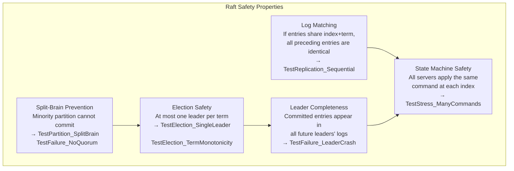

**Key implementation decisions:**

| Decision | Why |
|---|---|
| Persist `currentTerm` and `votedFor` **before** responding to RPCs | Prevents voting twice if the node crashes and restarts mid-election |
| Only commit entries from the **current term** (§5.4.2) | Prevents the "Figure 8" scenario where a previous term's entry is incorrectly committed |
| Randomise election timeouts | Prevents persistent split votes in even-sized clusters |
| `ConflictTerm` / `ConflictIndex` in AppendEntries reply | Reduces log sync from O(n) round-trips to O(1) per inconsistent segment |
| Atomic write-rename in `FileStorage` | Prevents partial writes corrupting durable state on crash |

---

## References

| Resource | Description |
|---|---|
| [Raft Paper](https://raft.github.io/raft.pdf) | Original paper - Ongaro & Ousterhout, 2014 |
| [Extended Raft](https://pdos.csail.mit.edu/6.824/papers/raft-extended.pdf) | Full version with membership changes and snapshots |
| [Raft Visualization](https://raft.github.io/) | Interactive step-by-step animation |
| [MIT 6.824](https://pdos.csail.mit.edu/6.824/) | Distributed Systems course (test structure inspiration) |
| [TLA+ Spec](https://github.com/ongardie/raft.tla) | Formal specification used to verify the algorithm |

---

## License

MIT - see [LICENSE](LICENSE) for details.
